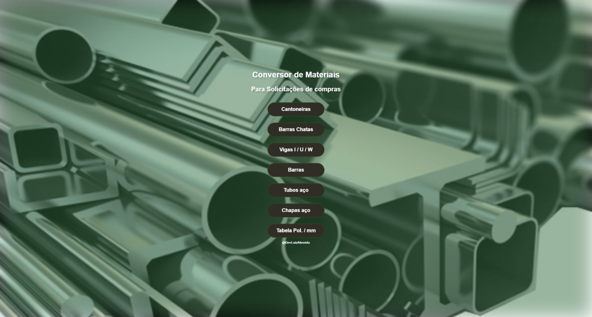

<h1 align="center"> Conversor de materiais </h1>

 

  

## 🚀 Tecnologias

Esse projeto foi desenvolvido com as seguintes tecnologias:

- HTML e CSS
- JavaScript
- Git e Github

## 💻 Projeto integrador I - univesp

O Conversor de materiais foi criado para facilitar a vida na hora de efetuar a compra das chaparias.

